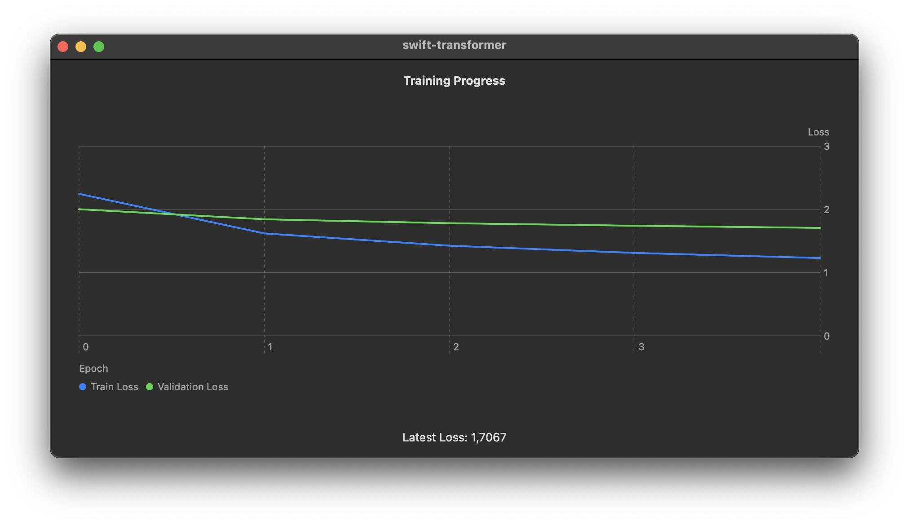

# Swift-Transformer

Swift-Transformer is a comprehensive Swift-based project designed to bring advanced machine learning capabilities to Apple's ecosystem, specifically optimized for Apple Silicon devices. This project leverages [MLX-Swift](https://github.com/ml-explore/mlx-swift/tree/db6e838c7bbfc1bb8a1475bfa7cea0baf1ba8835), an array framework for machine learning research, ensuring seamless integration and performance enhancements on macOS platforms.

## Features

- **Native Swift Implementation**: Entirely rewritten in Swift, leveraging powerful features of the language for high performance.
- **Apple Silicon Optimization**: Specifically optimized for Apple Silicon, utilizing the full potential of the latest hardware accelerations.
- **MLX-Swift Integration**: Replaces Numpy with MLX-Swift, a Swift library designed for array operations in machine learning research, providing faster and more efficient computations on Apple Silicon.
- **Native GPU Utilization**: By default, MLX-Swift leverages the native GPU capabilities of Apple Silicon, resulting in significantly faster and more efficient performance compared to standard Numpy and Python implementations.
- **Metal Support**: Transitions from traditional GPU usage to Apple’s Metal, enhancing computational capabilities for machine learning tasks.

Based on the original Numpy-Transformer project by AmritanshuV. [Link](https://github.com/AmritanshuV/Numpy-Transformer)

**For additional notes, dependencies, and acknowledgements, please refer to [NOTES.md](NOTES.md).**

## Complete performance information and comparison can be found in the performance data folder.

#### Summary:

On average, the Swift variant is approximately **36.75×** faster during training and **26.12×** faster during testing compared to the Python variant.*

\* It’s worth noting, however, that MLX operates on GPUs by default. The Python version utilizes either NumPy or CuPy. One is CPU-based, while the other is limited to NVIDIA GPUs, which Macs don’t support.

## Loss History Graph

The graph below illustrates the training and validation loss over the epochs:

